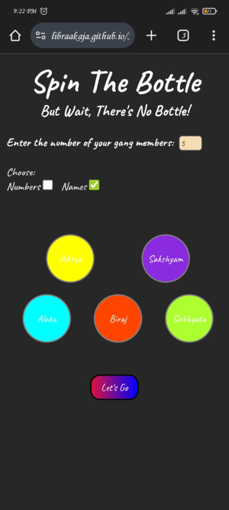
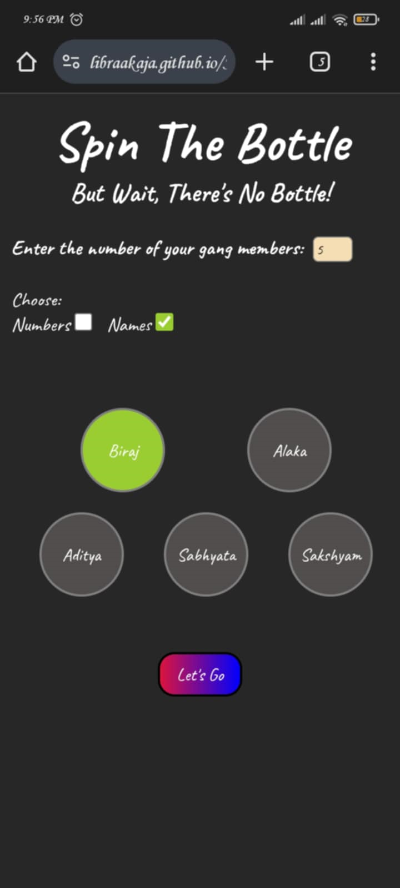

# 🎉 Spin The Bottle

A simple and fun **party game** built with **HTML, CSS, and JavaScript**. Whether you're playing **Truth or Dare** or any other party challenge, this web app lets you to randomly select a participant!

## 🌟 Features
- **Two modes**: Use **names** or assign **numbers** to participants.
- **Randomized selection**: Ensures fairness in choosing players.
- **Fully responsive**: Works smoothly across different devices.
- **Simple UI**: Clean and intuitive design for easy use.
- **Playable on GitHub Pages**: No installation needed!

## 🎮 How to Play
1. Enter the names or assign numbers to the players.
2. Click the **Let's Go** button to start the game.
3. A random person is selected.
4. Use the result for your party game (e.g., **Truth or Dare**).

## 🌐 Live Demo
[Play Now](https://LibraAkaja.github.io/Spin-The-Bottle/) 🎲

## 📦 Installation
If you want to run it locally, follow these steps:

```sh
# Clone the repository
git clone https://github.com/LibraAkaja/Spin-The-Bottle.git

# Navigate to the project folder
cd Spin-The-Bottle

# Open index.html in a browser
```

## 🖼 Screenshots



## 🛠 Technologies Used
- 🎨 **HTML & CSS** - For the user interface and styling.
- ⚡ **JavaScript** - For game logic and interactivity.
- 🌐 **GitHub Pages** - For hosting the game online.

## 🤝 Contributing
This project is currently **not open for contributions**. If you have any suggestions or feedback, feel free to open an issue.

## 🚫 License
This project is for personal or educational use only. Redistribution or commercial use is not allowed.

## 📞 Contact
For any inquiries or feedback, feel free to reach out:  
- 📧 **Email:** [adhikaribiraj908@gmail.com](mailto:adhikaribiraj908@gmail.com)  
- 🔗 **GitHub Issues:** [Report a Bug or Suggest a Feature](https://github.com/LibraAkaja/Spin-The-Bottle/issues)  
